# Database Sampah untuk Bank Sampah Berseri (BSB)

**Desa Krandegan, Kec. Bulukerto, Kab, Wonogiri, Jawa Tengah**

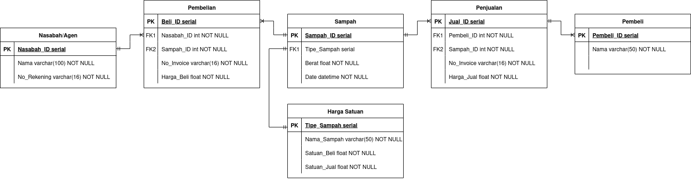

Sebuah inovasi web app untuk melakukan digitalisasi pencatatan invetoris sampah, untung-rugi, dan tabungan nasabah serta agen. Teknologi yang digunakan adalah:
- MariaDB (MySQL) sebagai database relasional utama
- Python (Fast API) sebagai backend
- HTMX + Jinja Templating sebagai frontend

## 1. Setup Database

### Koneksi Database

> Langkah koneksi ke database dikhususkan pada perangkat Linux karena hardware tempat sistem ini bekerja menggunakan OS Linux. Panduan bagi OS lain dapat diakses melalui tautan resmi MariaDB: https://mariadb.com/docs/server/mariadb-quickstart-guides/installing-mariadb-server-guide 
> 
> Langkah-langkah di bawah hanya untuk melakukan koneksi ke server database. Maka dari itu, lakukan instalasi dan setup user root terlebih dahulu

#### Koneksi Localhost

1. Pastikan maria-db telah terinstal
2. Cek status layanan `mariadb` 
```
sudo systemctl status mariadb
```
3. Jalankan layanan `mariadb` jika hasil perintah di atas tidak menunjukan bahwa `mariadb` sudah berjalan
```
sudo systemctl start mariadb
```
4. (Recommended) Koneksi ke server `mariadb` dilakukan melalui tool GUI seperti [DBeaver](https://dbeaver.io/download/)

5. Pilih menu Database > New Database Connection

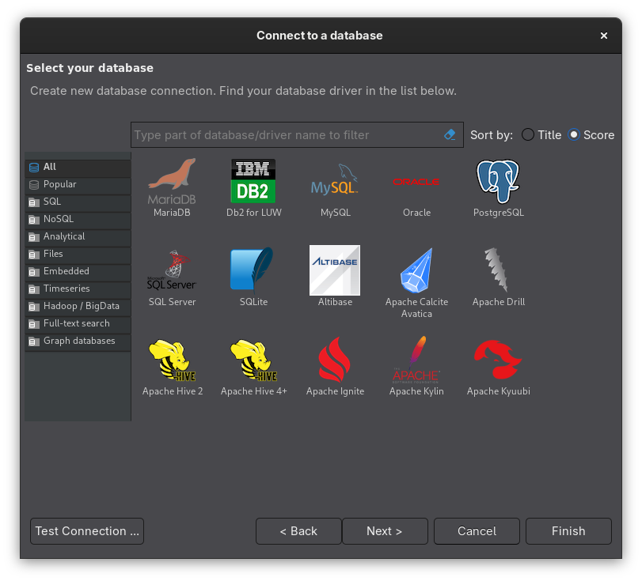

6. Pilih MariaDB kemudian isikan `Server Host` (alamat server `mariadb`), `username` dan `password` yang sudah di-setup sebelumnya.

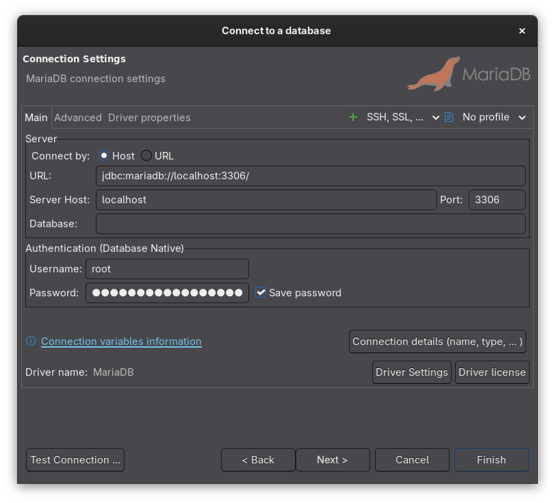

7. Lakukan test connection. Jika berhasil, maka klik finish kemudian koneksi akan muncul di bagian kiri interface.

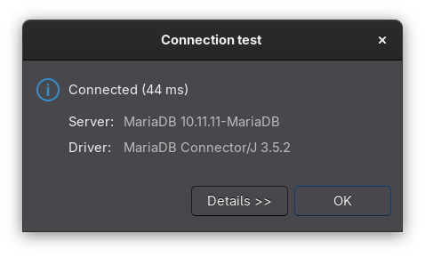 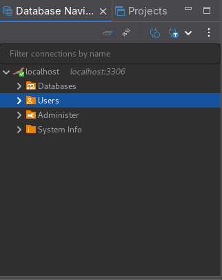

8. (Alternatif) Masuk ke server `mariadb` menggunakan CLI dengan melakukan perintah berikut
```
mariadb -u root -p
```
Kemudian berikan password yang sudah di-setup sebelumnya

#### Koneksi Remote

Untuk memastikan koneksi dapat dilakukan dari host lain (remote host), pastikan konfigurasi berikut telah dilakukan:

1. Atur supaya `mariadb` mendengarkan koneksi masuk dari remote host dengan mengubah file `/etc/my.cnf` seperti di bawah:

```
[mysqld]
bind-address = 0.0.0.0 # atur sesuai dengan kebutuhan
```
> Jika file konfigurasi tidak berada di /etc/my.conf, jalankan perintah berikut:

```
maraidb --help --verbose
```
Cari output yang menandakan `Default options are read from the following files in the given order: /etc/my.cnf /etc/mysql/my.cnf ~/.my.cnf`. Dari sini akan terlihat path file konfigurasi yang digunakan `mariadb`. 

2. Atur supaya firewall tidak memblokir koneksi masuk ke port `3306` melalui `tcp` (port dan protokol bawaan MySQL):

```
sudo ufw allow 3306/tcp
```

3. Buat dan berikan permission khusus untuk akun remote. Contoh, perintah berikut memberikan akses semua operasi (ALL PRIVILEGE) terhadap semua table di database 'sampah' untuk remote host dengan username 'remote_user' dari IP range '192.168.100.0/24' dengan password 'securepass':

```
CREATE USER 'remote_user'@'192.168.100.%' IDENTIFIED BY 'securepass';
GRANT ALL PRIVILEGES ON sampah.* TO 'remote_user'@'192.168.100.%';
FLUSH PRIVILEGES;
```

4. Lakukan koneksi menggunakan DBeaver tetapi ganti `localhost` menjadi alamat IP server `mariadb` dan sesuaikan username serta password dengan yang telah dibuat sebelumnya.

> Pastikan perangkat yang digunakan untuk melakukan koneksi ke MariaDB berada di range IP yang sudah didefinisikan sebelumnya (kalau mengikuti contoh, berarti perangkat kita harus berada di range IP 192.168.100.0/24, alias hanya local network saja)

### Script SQL

Di repo ini, terutama di folder `sql`, terdapat beberapa script SQL untuk mendefinisikan data (DDL) dan memanipulasi data (DML) seperti operasi insertion. Catatan: operasi insertion drekomendasikan untuk dilakukan menggunakan antarmuka web app *tidak* langsung melalui DBeaver atau console MariaDB. Untuk menggunakan script tersebut (terutama script DDL), lakukan langkah-langkah berikut:

1. Buka DBeaver dan pilih tanda panah ke bawah dekat SQL Script. Klik Open SQL Script

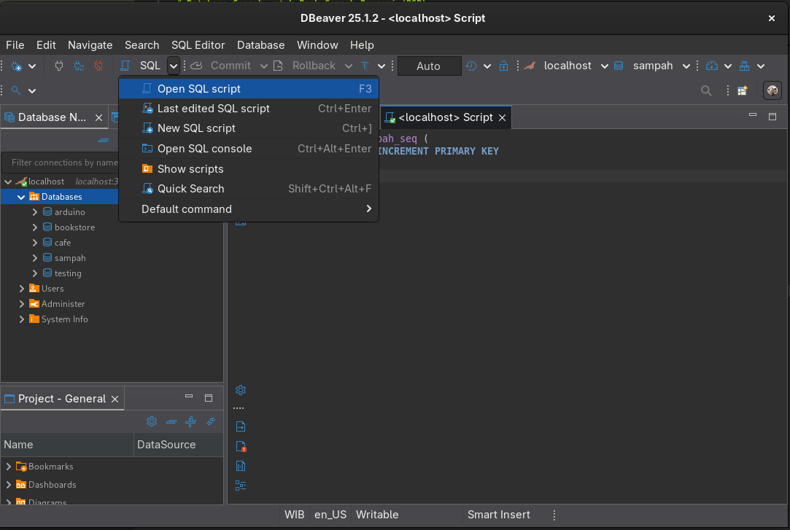

2. Navigasi ke menu SQL Editor kemudian pilih Import SQL Script.

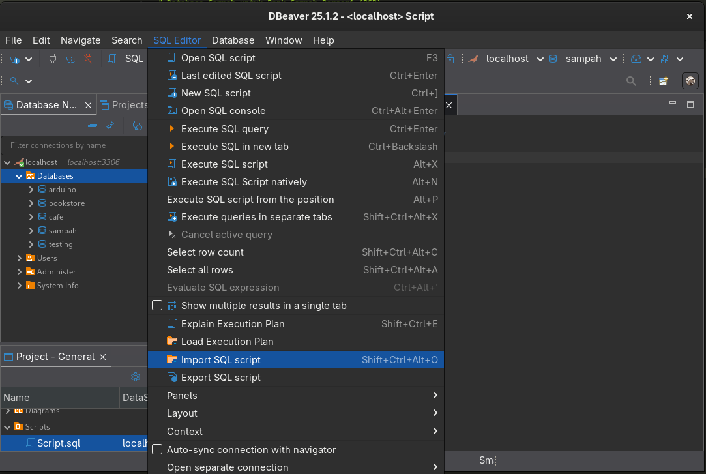

3. Menu tersebut akan membuka Window untuk memilih script yang sudah di-download sebelumnya. Pilih script tersebut kemudian jika sudah berhasil di-import tampilannya akan seperti ini:

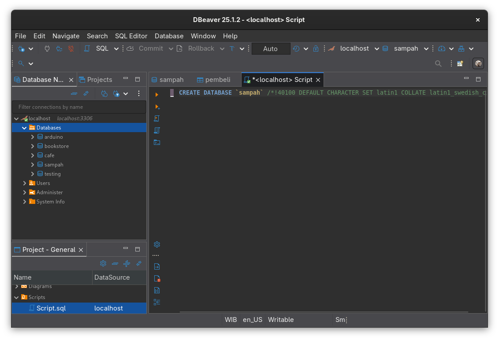

4. Pilih icon Play untuk menjalankan script yang sudah di-import sebelumnya. 

#### Tambahan untuk script Triggers:

Triggers adalah script khusus SQL yang akan berjalan ketika seuatu event terjadi. Pada kasus database ini, saya menggunakan trigger untuk melakukan auto-generation terhadap no rekening nasabah, nomor unik pembeli, dan nomor invoice pembelian serta penjualan. Hal ini untuk memudahkan proses insertion ke depannya, sehingga admin hanya menambahkan data yang diperlukan saja (nama, jenis sampah, berat, dsb) tanpa perlu memikirkan logic identifier di belakang layar :D

1. Pada DBeaver, pilih tabel yang ingin diberikan trigger, contohnya tabel pembelian. Klik kanan folder Triggers dan pilih New Trigger.

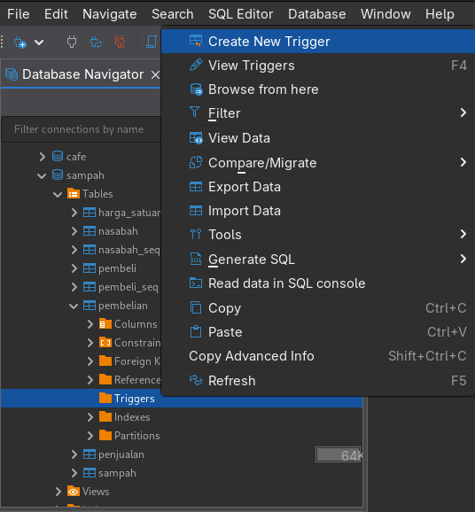

2. Beri nama Trigger. Jika ingin melakukan import dari script yang ada di repo ini, **pastikan nama Trigger sama dengan nama Trigger yang tertera pada script**

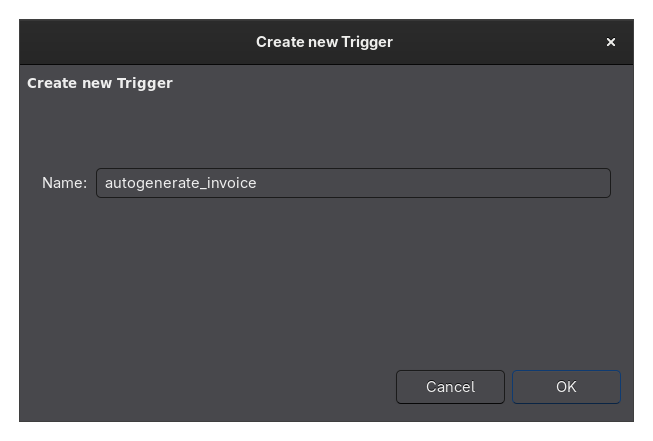

3. Lakukan Copy & Paste script Trigger yang diinginkan pada bagian ini.

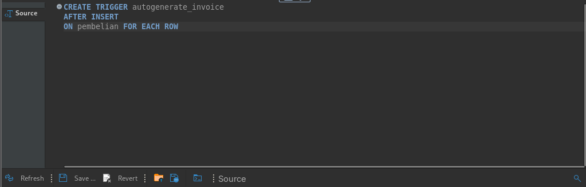

4. Jika sukses makan Trigger akan muncul di bawa tabel Trigger:

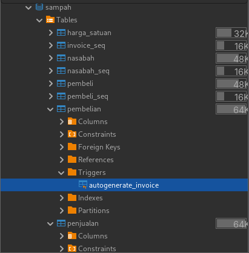

## 2. Menjalankan Server

Komponen Backend projek ini menggunakan FastAPI. Berikut adalah langkah untuk menjalankan server:

1. Install Requirements

Install dependensi menggunakan `pip`. Pastikan Python versi 3.12 ke atas dan disarankan membuat virtual environment ketika melakukan instalasi dependensi:

```bash
python -m venv .venv
source .venv/bin/activate
pip install -r requirements.txt
```

2. Menjalankan Uvicorn

Jalankan server FastAPI menggunakan Uvicorn supaya ketika terdapat perubahan, server akan langsung me-refresh (mirip nodemon):

```bash
uvicorn main:app -h 0.0.0.0 --reload
```

- `main` adalah nama file Python utama (contohnya `main.py`).
- `app` adalah nama objek FastAPI yang dideklarasikan di code.
- `--reload` menyalakan mode auto-refresh.

Server dapat diakses di alamat default `http://127.0.0.1:8000` atau ganti `127.0.0.1` dengan IP address lokal tempat server dipasang. 

3. Informasi Tambahan

Bisa diakses melalui [dokumentasi FastAPI](https://fastapi.tiangolo.com/).

### API Endpoints

Untuk mengakses tabel lengkap API endpoint bisa mengunjungi endpoint /docs.

## 3. Mengakses Admin Panel


Ketika server dijalankan, admin panel akan secara otomatis ter-load. Masukkan username dan password untuk mengakses dashboard serta endpoint lainnya. 

## Credits

Proyek KKN setengah Capstone ini merupakan Program Kerja Unggulan Klaster Saintek KKN-PPM UGM II 2025 Bolo Bulukerto. Dibuat oleh Fidelya Fredelina untuk Pengurus BSB Desa Krandegan.
