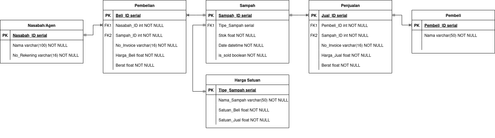

# Database Sampah untuk Bank Sampah Berseri (BSB)

**Desa Krandegan, Kec. Bulukerto, Kab, Wonogiri, Jawa Tengah**

Sebuah inovasi web app untuk melakukan digitalisasi pencatatan invetoris sampah, untung-rugi, dan tabungan nasabah serta agen. Teknologi yang digunakan adalah:
- MariaDB (MySQL) sebagai database relasional utama
- Python (Fast API) sebagai backend
- HTMX + Jinja Templating sebagai frontend

## Dokumentasi

Akses dokumentasi lengkap telah dipindah ke halaman wiki: [Wiki Database BSB](https://github.com/lindduncoding/database-bsb/wiki)

## Credits

Proyek KKN setengah Capstone ini merupakan Program Kerja Unggulan Klaster Saintek KKN-PPM UGM II 2025 Bolo Bulukerto. Dibuat oleh Fidelya Fredelina untuk Pengurus BSB Desa Krandegan.
